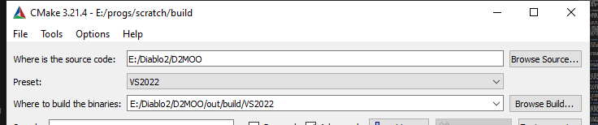
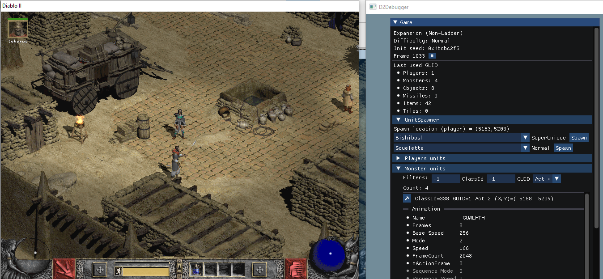

# D2MOO - Diablo II Method and Ordinal Overhaul


This project is a re-implementation of the Diablo2 game coupled with patching facilities for modders.
The aim is to provide the modding community with an easy tool to understand and patch the game.
To ensure that we stay as close as possible to the original game, we do not provide fixes for bugs (yet).

The game assets, main executable code and anything related to hacking or piracy is NOT endorsed by the authors, and as such we will not provide code related to such subjects.
The original game assets and binaries is required to use this project.

## How to build

### Dependencies

For the patching we rely on the [D2.Detours](https://github.com/Lectem/D2.Detours.git) project, which is included as a git submodule. (use the `git submodule update --init` command, or clone this project with `git clone --recursive`)
You will also need to install the [CMake](https://cmake.org) build system and Visual C++ (or any C++ compiler that can generate .DLLs on Windows) which are freely available.

### Build the project

The recommended way is to use CMake presets.
You can generate a VS solution (located in `out/build/VS20XX`) and build using the command-line:

```sh
# Configure the CMake project
cmake --preset VS2019
# Build the release config
cmake --build --preset VS2019 --config Release
# Install
cmake --build --preset VS2019 --config Release --target install
```

Or using the CMake-gui:


Where of course you can replace `VS2019` by `VS2022` if you are using Visual Studio 2022.

Read more in the [Advanced build and run](./doc/AdvancedBuildAndRun.md) documentation.

## Usage

If you are using a default Diablo2 install and generated `.sln` through *CMake*, you are good to go, simply build and run with `F5`!

Otherwise have a look at the [Advanced build and run](./doc/AdvancedBuildAndRun.md) and [Debugging](./doc/Debugging.md) documentation.

## D2MOO Debugger (Experimental!)

Start the game with the `-debug` argument.
For example: `D2.DetoursLauncher -- -debug`.  
Alternatively, you may set the environment variable `D2_DEBUGGER=1`.



## Versions

The project is currently based on the 1.10f version of the game.
Feel free to submit patches for other versions of the game!

## FAQ

### Why is the code so ugly and with names such as `a1`, `a2`, ... ?

The code was originally extracted using a reverse engineering tool, and slowly cleaned to use more understandable names.

### Can I build D2Common.dll and replace it directly with the one from the game ?

Not yet, but this is one of the objectives !
We are in the (slow) process of checking each ordinal (exported functions) and patching them one by one. See [D2Common.patch.cpp](D2.Detours.patches/1.10f/D2Common.patch.cpp) for the current status of each ordinal.

### Why are some DLLs missing ?

Reversing the game is very time consuming. Since `D2Common.dll` and `D2Game.dll` contain most of the game logic, this is where the focus has been set. Any contribution and help is welcome !

### How can I write my own mod using this ?

The documentation for that is not written yet, please contact us directly on the Phrozen Keep [forums](https://www.d2mods.info) / [Discord server](https://discord.gg/NvfftHY).
More importantly, we need your [feedback](https://github.com/ThePhrozenKeep/D2MOO/issues/20) to determine a roadmap.

### Why yet another project for D2 modding and code editing ?

We felt that the current projects are not good enough, and more importantly did not cover enough parts of the game.
Having a centralized code that one can launch and use as reference will make it easier, we hope, for the modding community.

### I can not set breakpoints in Visual Studio

Please have a look at [Microsoft Child Process Debugging Power Tool](https://marketplace.visualstudio.com/items?itemName=vsdbgplat.MicrosoftChildProcessDebuggingPowerTool).

### I have other questions !

Please feel free to open an issue or visit the Phrozen Keep [forums](https://www.d2mods.info) / [Discord server](https://discord.gg/NvfftHY) !


## Credits

This could not have been done without the amazing help and work of the Phrozen Keep community!
Non-exhaustive list of members who helped putting this together (alphabetical order):

 * @Araksson (aka @Conqueror)
 * @dzik
 * @FearedBliss
 * @Firehawk
 * @Harvest
 * @Kieran
 * @Kingpin
 * @Lectem
 * @lolet
 * @Mentor
 * @MirDrualga (aka @IAmTrial)
 * @misiek1294
 * @Mnw1995
 * @Myhrginoc
 * @Necrolis
 * @Nefarius
 * @Nizari
 * @Ogodei
 * Paul Siramy
 * @raler (that sparked the idea for the current name of the project)
 * @SVR
 * @Szumigajowy
 * @whist
 * ...

If you think you should be on this list, reach us on the forum, discord, or open a pull request!

## Legal


The source code in this repository is intended for non-commercial use only. However it uses a permissive license so that any modder may use this. Credits to the team are appreciated, and the license must be preserved in derivative work.

Battle.net(R) - Copyright (C) 1996 Blizzard Entertainment, Inc. All rights reserved. Battle.net and Blizzard Entertainment are trademarks or registered trademarks of Blizzard Entertainment, Inc. in the U.S. and/or other countries.

Diablo(R) - Copyright (C) 1996 Blizzard Entertainment, Inc. All rights reserved. Diablo and Blizzard Entertainment are trademarks or registered trademarks of Blizzard Entertainment, Inc. in the U.S. and/or other countries.

D2MOO and any of its' maintainers are in no way associated with or endorsed by Blizzard Entertainment(R).

