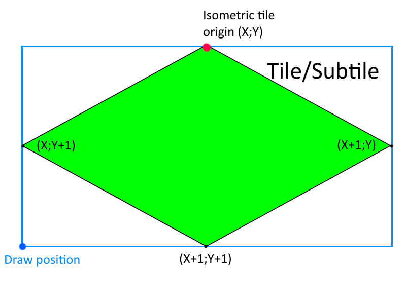

# Coordinate systems in Diablo2

Diablo2 has quite a few coordinate systems with different precisions.
We'll try to list them with their various precisions using terms that will be reused in the code to facilitate communication and sharing. This list is non-exhaustive.

# World coordinates

## Cartesian coordinates

The cartesian coordinates are alined with the screen axes (but not the same oritentation!)

- `Floor tiles` are 160x80 pixels.
  - It is made of 5x5 `Subtiles` of 16x8 pixels each
- `Wall tiles` have a varying dimension, but are made of blocks of 32x32 pixels

## Isometric coordinates

To simplify, Isometric coordinates are aligned with the tiles axes and can be obtained with the formula:

- `isoX =  cartX + 2 * cartY`
- `isoY = -cartX + 2 * cartY`

Precision of the coordinates:

- `Room`: Used to group units and tiles in a single entity. Its size is 8x8 `Floor tiles`.
- `Floor tiles`: Its size is 5x5 `Subtiles`.
- `Subtiles`: This is the precision used to determine collision flags and properties. Equivalent to 8x8 `World coordinates` units.
- `World coordinates`: Granularity used for collisions, light computations and position of moving units in general.
- `Game coordinates`: Used for paths, uses a 16bit fixed point representation of the `World position`.

## Cardinal points

- East: Positive X
- West: Negative X
- South: Positive Y
- North: Negative Y

## Conversion functions

| Coordinates A                   | Coordinates B     | A => B                                                | 1.10f ordinal  | B => A                                                 | 1.10f ordinal  |
|---------------------------------|-------------------|-------------------------------------------------------|----------------|--------------------------------------------------------|----------------|
| Cartesian pixel                 | Isometric tile    | DUNGEON_CartesianToIsoTileCoords                      | D2Common@10107 | DUNGEON_IsoTileToCartesianCoords                       | D2Common@10110 |
| Cartesian pixel                 | Isometric subtile | DUNGEON_CartesianToIsoSubtileCoords                   | D2Common@10108 | DUNGEON_IsoSubTileToCartesianCoords                    | D2Common@10111 |
| Cartesian unit                  | Isometric unit    | DUNGEON_CartesianToIsometricCoords                    | D2Common@10109 | DUNGEON_IsometricToCartesianCoords                     | D2Common@10112 |
| Isometric Tile                  | Isometric Subtile | DUNGEON_IsoTileToSubtileCoords                        | D2Common@10113 | N/A                                                    | N/A            |
| Cartesian (Draw position)       | Isometric tile    | DUNGEON_CartesianDrawPositionToIsometricCoords*       | D2Common@10114 | DUNGEON_IsometricToCartesianTileDrawPositionCoords*    | D2Common@10115 |
| Cartesian (Draw position)       | Isometric subtile | DUNGEON_CartesianSubileDrawPositionToIsometricCoords* | D2Common@10116 | DUNGEON_IsometricToCartesianSubtileDrawPositionCoords* | D2Common@10117 |

*The `Cartesian(Sub)TileDrawPosition` functions will provide the draw position in cartesion space of the source unit.

A picture is worth a thousand words.
Given a Tile/Subtile (green) isometric coordinate `(X;Y)`, you will obtain:
- The **BLUE** dot when using the `Isometric(Sub)TileToCartesian(Sub)TileDrawPosition` functions. While this is the draw position. This is not in screen coordinates, Y is still facing down!
- The **RED** dot when using the `Isometric(Sub)TileToCartesian` functions.

# Screen position

This is the coordinate system used for the GUI.
Starts at the bottom-left of the screen. X faces to the right, Y faces up.

# Naming convention in D2Moo

TODO