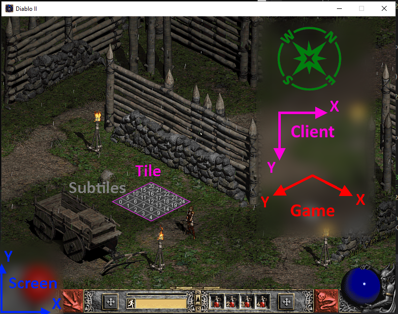
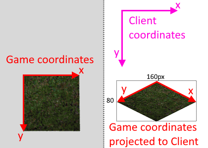
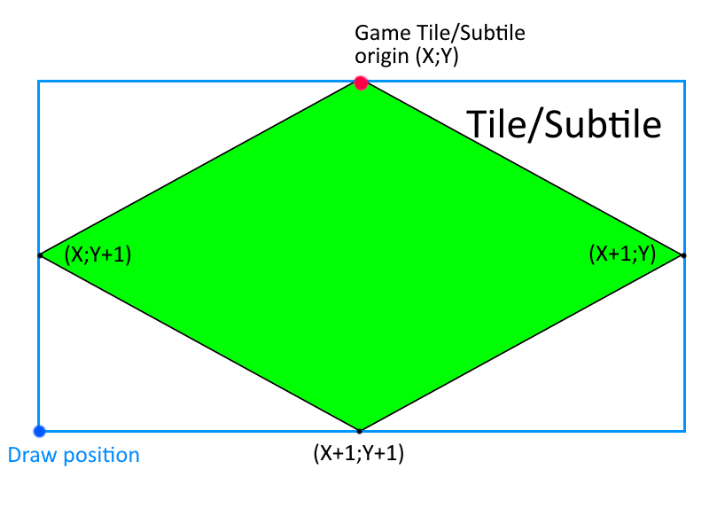

# Coordinate systems in Diablo2

Diablo2 has quite a few coordinate systems with different precisions.
We'll try to list them with their various precisions using terms that will be reused in the code to facilitate communication and sharing. This list is non-exhaustive.

# Coordinates

The game uses a 2d grid with various resolutions depending on what it needs to achieve.
This 2d grid is then projected using an Isometric projection (actually a Dimetric projection which leads to a 2:1 ratio).

To avoid simplify things and avoid naming issues, we'll be speaking of "Game coordinates" for all the logic, and "Client" coordinates for the projected coordinates.

## Game coordinates

To simplify, game coordinates are aligned with the tiles axes.

The following formulae can be used to transform between game and client coordinates (assuming the same precision).

### Game to client (dimetric projection)
- `clientX = 2 * gameY + gameX`
- `clientY = 2 * gameY - gameX`

### Client to game
- `gameX = (clientX - clientY) / 2`
- `gameY = (clientX + clientY) / 4`

### Precision of the coordinates

| Precision              | Ratio to parent | Size in game coords | Names in D2Moo | Desc                                                                                              |
|------------------------|-----------------|---------------------|----------------|---------------------------------------------------------------------------------------------------|
| Room                   | 1               | 40                  | RoomX/Y        | Used to group units and tiles in a single entity                                                  |
| Floor tiles            | 8               | 5                   | TilesX/Y       | Group of subtiles used for map edition                                                            |
| Subtiles/Gamecoords    | 5               | 1                   | X/Y            | Used to determine floor collision flags and properties. (Called GameSquare in the original code?) |
| Fractional coordinates | 2¹⁶ = 65536     | 1/65536             | PrecisionX/Y   | Used for paths, 16bit fixed point representation of the Game Coordinates                          |

There are also `Light coordinates`: 1/8 subtile (to verify).

## Cardinal points

Some code/assets may refer to cardinal points for orientation (for example the Rogue Encampment exit).

- **East**: Positive X
- **West**: Negative X
- **South**: Positive Y
- **North**: Negative Y

## Client coordinates

The client coordinates are aligned with the screen axes (but not the same oritentation!). They are the coordinates obtained by going through the dimetric projection.
This matches the pixels representation of the game (if we ignore the fake perspective option). All graphics assets are represented in this coordinate system.

A "square" of the `Game coordinates` grid is represented as a diamond shape in the client coordinates. Note that walls are however represented in blocks of **32x32** pixels.

| Precision           | Ratio to parent | Size in pixels |
|---------------------|-----------------|----------------|
| Room                | 1               | 1280x640       |
| Floor tiles         | 8               | 160x80         |
| Subtiles/Gamecoords | 5               | 32x16          |
| Wall block          | 1/2             | 32x32          |

## Conversion functions

| Coordinates A | Coordinates B            | A => B                                           | 1.10f ordinal  | B => A                                          | 1.10f ordinal  |
|---------------|--------------------------|--------------------------------------------------|----------------|-------------------------------------------------|----------------|
| Game tile     | Client pixel             | DUNGEON_GameTileToClientCoords                   | D2Common@10110 | DUNGEON_ClientToGameTileCoords                  | D2Common@10107 |
| Game subtile  | Client pixel             | DUNGEON_GameSubTileToClientCoords                | D2Common@10111 | DUNGEON_ClientToGameSubtileCoords               | D2Common@10108 |
| Game unit     | Client unit              | DUNGEON_GameToClientCoords                       | D2Common@10112 | DUNGEON_ClientToGameCoords                      | D2Common@10109 |
| Game Subtile  | Game Tile                | N/A                                              | N/A            | DUNGEON_GameTileToSubtileCoords                 | D2Common@10113 |
| Game tile     | Client (Render position) | DUNGEON_GameToClientTileRenderPositionCoords*    | D2Common@10115 | DUNGEON_ClientRenderPositionToGameCoords*       | D2Common@10114 |
| Game subtile  | Client (Render position) | DUNGEON_GameToClientSubtileRenderPositionCoords* | D2Common@10117 | DUNGEON_ClientSubileRenderPositionToGameCoords* | D2Common@10116 |

*The `Client(Sub)TileRenderPosition` functions will provide the draw position in Client space of the source unit.

A picture is worth a thousand words.
Given a Tile/Subtile (green) game coordinate `(X;Y)`, you will obtain:
- The **BLUE** dot when using the `Game(Sub)TileToClient(Sub)TileRenderPosition` functions. While this is the rendering position, this is not in screen coordinates, Y is still facing down!
- The **RED** dot when using the `Game(Sub)TileToClient` functions.

# Screen position

This is the coordinate system used for the GUI.
Starts at the bottom-left of the screen. X faces to the right, Y faces up.

# Naming convention in D2Moo

TODO