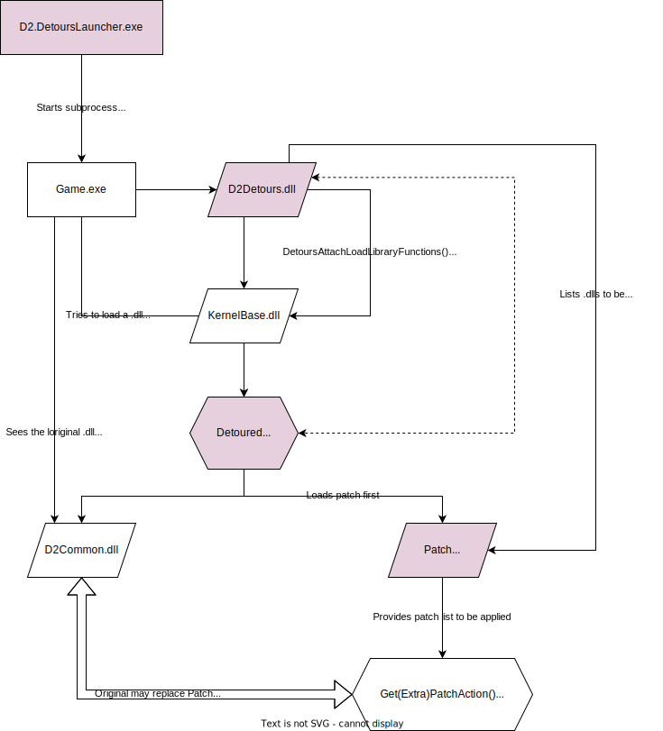

# Patching

There are many ways to patch an executable.
By default D2MOO is based on [D2.Detours](https://github.com/Lectem/D2.Detours) but you could use your own patching mechanism if needed.

## Overview

Diablo II does not load all its `.dll`s on startup.
This means we either need to force it to load its `.dll`s, or patch them as soon as they are loaded. The second approach is the one used by *D2.Detours*.

When *D2.Detours* is injected into the process, it patches the [`LoadLibrary*`](https://learn.microsoft.com/en-us/windows/win32/api/libloaderapi/nf-libloaderapi-loadlibraryw) functions. This way we may act on any `.dll` loaded into the process.

When a `.dll` load attempt is made, we complete the load then patch all newly loaded `.dll`s before returning control to the process. This means we load both the original and patch `.dll`s, and both can call each other.



## Patch actions

Each `.dll` in D2MOO exposes a few functions needed to list what functions/pointers needs to be patched. This is located in the [D2.Detours.patches](D2.Detours.patches/1.10f) folder.

The functions to be implemented (and exported) are the following:

```cpp
extern "C" {
	typedef int(__cdecl* GetIntegerFunctionType)();
	typedef PatchAction (__cdecl *GetPatchActionType)(int ordinal);
	typedef ExtraPatchAction* (__cdecl* GetExtraPatchActionType)(int extraPatchActionIndex);
}

// Must be exposed by the patch dll and return the 1st ordinal to patch
GetIntegerFunctionType GetBaseOrdinal;
// Must be exposed by the patch dll and return the last ordinal to patch
GetIntegerFunctionType GetLastOrdinal;
// Must be exposed by the patch dll and return the action to take for a given ordinal
GetPatchActionType GetPatchAction;

// Must be exposed by the patch dll if extra patches are needed
GetIntegerFunctionType GetExtraPatchActionsCount;
// Must be exposed by the patch dll and return the action to take for a given extra action index
// Note that the returned pointer must be valid until the end of the patching, and not be reused between GetExtraPatchAction calls since we will fill the detouredPatchedFunction field.
GetExtraPatchActionType GetExtraPatchAction;
```


Each `.dll` has its own `NAME.patch.cpp` file containing such functions, which will return for each ordinal (or address), a `PatchAction` (or `ExtraPatchAction`):

```c
enum PatchAction {
	FunctionReplaceOriginalByPatch,
	FunctionReplacePatchByOriginal,
	PointerReplaceOriginalByPatch,
	PointerReplacePatchByOriginal,
	Ignore
};


struct ExtraPatchAction {
	size_t originalDllOffset;
	void* patchData;
	PatchAction action;
	void* detouredPatchedFunction; // Filled with new address of the original function. You can use it to call the old function from your patch.
};
```

As can be seen, we can patch both ways, this is required because we do not want the patch .dll to call its own functions by default. Each patch must be opt-in.
